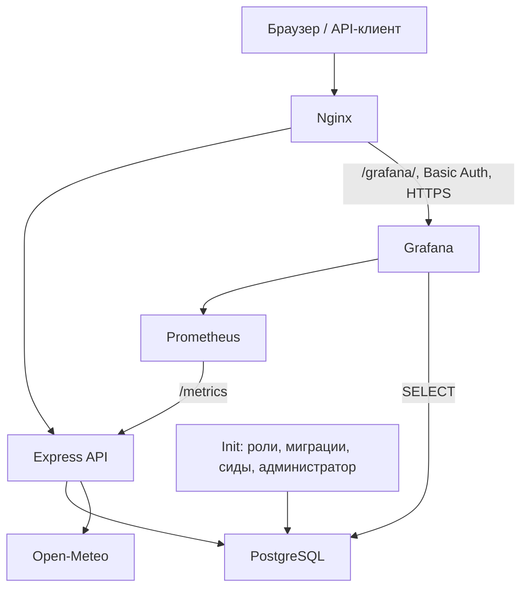

# Equipment Maintenance API

Сервис учёта оборудования и заявок на обслуживание: назначение бригад, история статусов, площадки и специалисты, отчёты и мониторинг

## Стек

TypeScript, Express, PostgreSQL 17, Sequelize, Umzug, Jest, Docker Compose, Nginx, Prometheus, Grafana



- Слои приложения: routes - controllers - services - repositories
- `init` подготавливает БД перед запуском API
- PostgreSQL и Prometheus доступны внутри сети Compose
- Данные PostgreSQL, Prometheus и Grafana сохраняются в Docker volumes

## Запуск с нуля

Требования: Git, Docker Engine с Compose либо Docker Desktop

Команды - для Git Bash

```bash
git clone https://github.com/ilia-kravtsov/equipment-maintenance-api.git
cd equipment-maintenance-api
cp .env.example .env
```

Заполнить в `.env`:

- `POSTGRES_PASSWORD`
- `DB_PASSWORD`
- `ACCESS_TOKEN_SECRET` - случайная строка не короче 32 символов
- `BOOTSTRAP_ADMIN_EMAIL`
- `BOOTSTRAP_ADMIN_PASSWORD` - не короче 8 символов
- `GRAFANA_ADMIN_PASSWORD`
- `GRAFANA_DB_PASSWORD`

`POSTGRES_DB` и `DB_NAME` должны совпадать
`POSTGRES_USER`, `DB_USER` и `GRAFANA_DB_USER` - разные роли

Запустить весь стек с локальным доступом к Grafana и БД:

```bash
docker compose -f docker-compose.yml -f docker-compose.dev.yml up -d --build
docker compose -f docker-compose.yml -f docker-compose.dev.yml ps -a
```

Нормальное состояние: `init` - `Exited (0)`, остальные сервисы работают

| Ресурс | Локальный адрес |
| --- | --- |
| Web UI | http://localhost:8080/ |
| Swagger UI | http://localhost:8080/api/docs/ |
| OpenAPI JSON | http://localhost:8080/openapi.json |
| Liveness | http://localhost:8080/api/health/live |
| Readiness | http://localhost:8080/api/health/ready |
| Grafana | http://localhost:3001/ |

Вход в приложение - через `BOOTSTRAP_ADMIN_EMAIL` и `BOOTSTRAP_ADMIN_PASSWORD`

Повторный запуск сохраняет данные

Для сервера используются основной Compose и HTTPS конфигурация

Подготовка сертификата и Basic Auth описана в [инструкции развёртывания](docs/deployment.md).

## Переменные окружения

Значения по умолчанию приведены в `.env.example`

### Приложение

| Переменная | По умолчанию | Назначение |
| --- | --- | --- |
| `PORT` | `3000` | Порт API при запуске через Node.js |
| `NODE_ENV` | `development` | Режим, в Compose - `production` |
| `HTTP_PORT` | `8080` | Внешний HTTP-порт Nginx |
| `TRUST_PROXY` | `0` | Доверие прокси, Compose задаёт `1` |
| `LOG_LEVEL` | `info` | Уровень логирования |
| `CORS_ORIGINS` | Локальные адреса из примера | Разрешённые origin через запятую |
| `RATE_LIMIT_WINDOW_MS` | `60000` | Окно общего лимита, мс |
| `RATE_LIMIT_MAX` | `100` | Запросов за окно |
| `WEATHER_API_URL` | Open-Meteo | Адрес сервиса погоды |
| `REQUEST_TIMEOUT_MS` | `5000` | Таймаут запроса погоды, мс |
| `WEATHER_MAX_WIND_SPEED` | `15` | Порог ветра для оценки условий работ |

### PostgreSQL

| Переменная | По умолчанию | Назначение |
| --- | --- | --- |
| `POSTGRES_DB` | `equipment_maintenance` | Создаваемая БД |
| `POSTGRES_USER` | `equipment_owner` | Владелец БД |
| `POSTGRES_PASSWORD` | Задать | Пароль владельца |
| `POSTGRES_PORT` | `5433` | Локальный порт БД в dev Compose |
| `DB_HOST` | `127.0.0.1` | Адрес БД, в Compose - `db` |
| `DB_PORT` | `5433` | Порт БД, в Compose - `5432` |
| `DB_NAME` | `equipment_maintenance` | БД приложения |
| `DB_USER` | `equipment_app` | Роль приложения |
| `DB_PASSWORD` | Задать | Пароль роли приложения |
| `DB_POOL_MAX` / `DB_POOL_MIN` | `5` / `0` | Размер пула соединений |
| `DB_POOL_ACQUIRE_MS` | `30000` | Ожидание соединения, мс |
| `DB_POOL_IDLE_MS` | `10000` | Простой соединения, мс |

### Аутентификация

| Переменная | По умолчанию | Назначение |
| --- | --- | --- |
| `ACCESS_TOKEN_SECRET` | Задать | Секрет подписи access token |
| `ACCESS_TOKEN_TTL_SECONDS` | `900` | Срок access token, секунды |
| `REFRESH_SESSION_TTL_DAYS` | `7` | Срок refresh-сессии, дни |
| `BCRYPT_ROUNDS` | `12` | Стоимость хеширования пароля |
| `LOGIN_RATE_LIMIT_WINDOW_MS` | `900000` | Окно лимита входа, мс |
| `LOGIN_RATE_LIMIT_MAX` | `10` | Попыток входа за окно |
| `BOOTSTRAP_ADMIN_EMAIL` | Задать | Email первого администратора |
| `BOOTSTRAP_ADMIN_PASSWORD` | Задать | Начальный пароль администратора |

### Grafana

| Переменная | По умолчанию | Назначение |
| --- | --- | --- |
| `GRAFANA_ADMIN_USER` | `admin` | Пользователь Grafana |
| `GRAFANA_ADMIN_PASSWORD` | Задать | Начальный пароль Grafana |
| `GRAFANA_PORT` | `3001` | Локальный порт в dev Compose |
| `GRAFANA_DB_USER` | `equipment_monitor` | Роль чтения данных для дашборда |
| `GRAFANA_DB_PASSWORD` | Задать | Пароль роли мониторинга |

## Роли и права

| Операция | viewer | technician | admin |
| --- | --- | --- | --- |
| Чтение оборудования, заявок, справочников и отчётов | Да | Да | Да |
| Создание, импорт и редактирование заявок | Нет | Да | Да |
| Смена статуса заявки | Нет | Только назначенный исполнитель | Да |
| Удаление заявок | Нет | Нет | Да |
| Изменение оборудования и справочников | Нет | Нет | Да |
| Назначение и снятие исполнителей | Нет | Нет | Да |

- Регистрация создаёт `viewer`
- Для работы `technician` аккаунт связывается со специалистом
- Управление ролями через публичный API не реализовано
- Защищённые запросы используют `Authorization: Bearer <accessToken>`
- Refresh token передаётся в HttpOnly cookie, при обновлении сессии заменяется
- `401` - Unauthorized - требуется аутентификация
- `403` - Forbidden - недостаточно прав доступа

## Мониторинг

- Локально: http://localhost:3001/, учётные данные `GRAFANA_ADMIN_*`
- На сервере: `/grafana/` через HTTPS, сначала Basic Auth Nginx, затем вход в Grafana
- Источники данных, дашборды и alert загружаются через provisioning
- API - технические показатели - дашборд: доступность API, RPS, доли 4xx/5xx, p95 времени ответа
- Обслуживание - прикладные показатели: заявки по статусам и приоритетам, среднее время закрытия, просроченные заявки, загрузка оборудования
- Alert недоступности API отображается в Grafana
- `/metrics` доступен Prometheus внутри Compose, Nginx снаружи возвращает - `404`

## Тесты

Требуется Node.js 24. Тесты очищают отдельную БД `equipment_maintenance_test`

После запуска локального стека:

```bash
npm ci
```

Один раз создать тестовую БД:

```bash
docker compose -f docker-compose.yml -f docker-compose.dev.yml exec -T db sh -c 'createdb -U "$POSTGRES_USER" equipment_maintenance_test'
```

Подготовить права и таблицы:

```bash
DB_NAME=equipment_maintenance_test npm run db:setup-role
DB_NAME=equipment_maintenance_test npm run db:migrate
```

Запустить тесты и coverage:

```bash
npm test -- --runInBand
npm test -- --runInBand --coverage
```

Для запуска тестов с компьютера используются `DB_HOST=127.0.0.1` и `DB_PORT=5433`

Отдельный запуск HTTP сервера не требуется

## API и Postman

- Полный перечень операций, параметры и ответы - в Swagger UI
- Коллекция: [Equipment-maintenance-api.postman_collection.json](docs/postman/Equipment-maintenance-api.postman_collection.json)
- Локальный `baseUrl`: `http://localhost:8080`
- Сначала выполнить `Login admin`, затем защищённые запросы

## Ограничения

- Один экземпляр API, лимиты запросов хранятся в памяти процесса
- HTTPS конфигурация привязана к домену демонстрационного сервера
- Данные о погодных условиях зависят от доступности Open-Meteo
- Списки площадок и специалистов возвращаются без пагинации

## Дополнительная документация

- [Развёртывание и эксплуатация](docs/deployment.md)
- [Архитектура и сценарий защиты](docs/architecture.md)